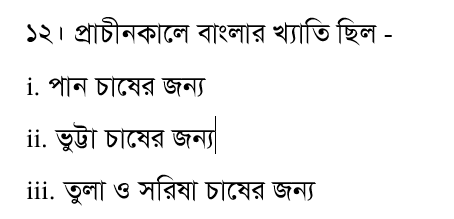
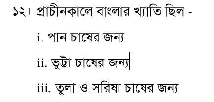
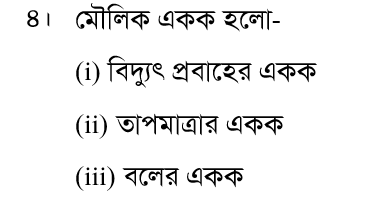
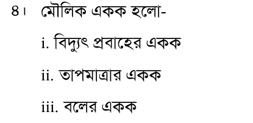

# এমএস ওয়ার্ড (MS Word) বাংলা প্রশ্নপত্র ফরম্যাটিং গাইড

এই নির্দেশিকায় এমএস ওয়ার্ডে ওয়াইল্ডকার্ড (Wildcards) বা রেগুলার এক্সপ্রেশন ব্যবহার করে বাংলা প্রশ্নপত্র এবং বহু নির্বাচনী প্রশ্নের (MCQ) অপশনগুলো দ্রুত সাজানোর পদ্ধতি আলোচনা করা হয়েছে। এর মাধ্যমে আপনি যেকোনো ডকুমেন্টের ফরম্যাটিং সহজে এবং সুনির্দিষ্টভাবে সম্পন্ন করতে পারবেন।

---

## সাধারণ প্রস্তুতি (General Settings)
যেকোনো ওয়াইল্ডকার্ড কোড রান করার আগে এমএস ওয়ার্ডে নিচের সেটিংসগুলো নিশ্চিত করুন:
1. কিবোর্ডে `Ctrl + H` চেপে **Find and Replace** বক্সটি খুলুন।
2. নিচে থাকা **More >>** বাটনে ক্লিক করে **Use wildcards** অপশনটিতে টিক চিহ্ন দিন।
3. মাঝখানে থাকা **Search:** ড্রপডাউন থেকে অবশ্যই **All** সিলেক্ট করুন (যাতে পুরো ডকুমেন্টে পরিবর্তনগুলো কার্যকর হয়)।

### ⚠️ একটি জরুরি সতর্কতা (Replace with বক্সে [ ] ব্যবহার)
এমএস ওয়ার্ডে **Replace with** বক্সে থার্ড ব্র্যাকেট `[ ]` টাইপ করা যাবে না। আপনি যদি সরাসরি `\1\2।[ ]` টাইপ করেন, তবে এমএস ওয়ার্ড সত্যি সত্যি থার্ড ব্র্যাকেটটি প্রিন্ট করে ফেলবে (যেমন: `ক।[ ]চর্বিসহ মাংস`)।
তাই **Replace with** বক্সে `[ ]` টাইপ না করে, কিবোর্ড থেকে সরাসরি একটি **স্পেসবার (Spacebar)** চাপবেন অথবা ইনডেন্ট সুন্দর করার জন্য একটি ট্যাব (**`^t`**) ব্যবহার করবেন।

---

## সূচিপত্র (Table of Contents)
1. [ধাপ ১: ১ থেকে ৩০ পর্যন্ত প্রশ্ন নম্বর অটো-অ্যালাইন করা (Hanging Indent)](#ধাপ-১-১-থেকে-৩০-পর্যন্ত-প্রশ্ন-নম্বর-অটো-অ্যালাইন-করা-hanging-indent)
2. [ধাপ ২: ৪টি অপশনকে ২ লাইনে সাজানো (ক-খ এবং গ-ঘ)](#ধাপ-২-৪টি-অপশনকে-২-লাইনে-সাজানো-ক-খ-এবং-গ-ঘ)
3. [ধাপ ৩: অপশনের ব্র্যাকেট মুছে নির্দিষ্ট ফন্ট সেট করা](#ধাপ-৩-অপশনের-ব্র্যাকেট-মুছে-নির্দিষ্ট-ফন্ট-সেট-করা)
4. [ধাপ ৪: অপশনগুলোতে অটো ইনডেন্টেশন (স্পেসকে ট্যাবে রূপান্তর)](#ধাপ-৪-অপশনগুলোতে-অটো-ইনডেন্টেশন-স্পেসকে-ট্যাবে-রূপান্তর)
5. [ধাপ ৫: সংখ্যা ও দাড়ির পর ট্যাব বজায় রাখা](#ধাপ-৫-সংখ্যা-ও-দাড়ির-পর-ট্যাব-বজায়-রাখা)
6. [ধাপ ৬: শেষের পূর্ণমান নম্বরগুলোকে ডানে পাঠানো (Right Tab)](#ধাপ-৬-শেষের-পূর্ণমান-নম্বরগুলোকে-ডানে-পাঠানো-right-tab)
7. [ধাপ ৭: প্রশ্নের শেষে বন্ধনীতে থাকা নম্বর ডানে সরানো (Right Tab)](#ধাপ-৭-প্রশ্নের-শেষে-বন্ধনীতে-থাকা-নম্বর-ডানে-সরানো-right-tab)
8. [ধাপ ৮: ৪টি পৃথক লাইনে থাকা অপশনগুলোকে ২ লাইনে নিয়ে আসা (ক-খ এবং গ-ঘ)](#ধাপ-৮-৪টি-পৃথক-লাইনে-থাকা-অপশনগুলোকে-২-লাইনে-নিয়ে-আসা-ক-খ-এবং-গ-ঘ)
9. [ধাপ ৯: ৪টি অপশনকে ৪টি পৃথক লাইনে (নিচে নিচে) সাজানো](#ধাপ-৯-৪টি-অপশনকে-৪টি-পৃথক-লাইনে-নিচে-নিচে-সাজানো)
10. [ধাপ ১০: অপশন ব্র্যাকেটের ভেতরের অপ্রয়োজনীয় স্পেস দূর করা](#ধাপ-১০-অপশন-ব্র্যাকেটের-ভেতরের-অপ্রয়োজনীয়-স্পেস-দূর-করা)
11. [ধাপ ১১: ব্র্যাকেটহীন অপশনগুলোকে ব্র্যাকেটে রূপান্তর করা](#ধাপ-১১-ব্র্যাকেটহীন-অপশনগুলোকে-ব্র্যাকেটে-রূপান্তর-করা)
12. [ধাপ ১২: লেখার ভেতরের অতিরিক্ত স্পেস দূর করা](#ধাপ-১২-লেখার-ভেতরের-অতিরিক্ত-স্পেস-দূর-করা)
13. [ধাপ ১৩: অপশনের বর্ণে ডট বা ব্র্যাকেট যোগ করা (পৃথক লাইনে)](#ধাপ-১৩-অপশনের-বর্ণে-ডট-বা-ব্র্যাকেট-যোগ-করা-পৃথক-লাইনে)
14. [ধাপ ১৪: রোমান সংখ্যা ফরম্যাটিং](#ধাপ-১৪-রোমান-সংখ্যা-ফরম্যাটিং)

---

## ধাপ ১: ১ থেকে ৩০ পর্যন্ত প্রশ্ন নম্বর অটো-অ্যালাইন করা (Hanging Indent)
প্রশ্ন নম্বরের পর দাড়ি ও স্পেস থাকলে তা স্বয়ংক্রিয়ভাবে অ্যালাইন করার নিয়ম:

### পদ্ধতি ক: প্রশ্ন নম্বরের পর দাড়ি ও স্পেস থাকলে

1. নিচের তথ্যগুলো দিন:
   * **Find what:**
     ```text
     ([০-৯]{1,2})।[ ]{1,}
     ```
   * **Replace with:**
     ```text
     \1।^t
     ```
2. **হ্যাঙ্গিং ইনডেন্ট (Hanging Indent) সেট করুন:**
   * **Replace with** বক্সে কার্সার রেখে নিচে থাকা **Format** > **Paragraph...**-এ যান।
   * **Special** ড্রপডাউন থেকে **Hanging** সিলেক্ট করুন এবং **By** বক্সে `0.5"` লিখে **OK** দিন।
3. সবশেষে **Replace All** বাটনে ক্লিক করুন।

#### উদাহরণ:
* **আগে (Before):**
  ```text
  ১০। আমাদের জাতীয় পশুর নাম কী এবং এটি কোথায় পাওয়া যায়?
  ```
* **পরে (After):**
  ```text
  ১০। → আমাদের জাতীয় পশুর নাম কী এবং এটি কোথায়
          পাওয়া যায়?

  *(নোট: → চিহ্নটি ট্যাব বোঝাচ্ছে। দ্বিতীয় লাইনটি স্বয়ংক্রিয়ভাবে প্রথম লাইনের লেখার সমান্তরালে চলে যাবে)*

---

### পদ্ধতি খ: প্রশ্ন নম্বরের পর দাড়ি ও ট্যাব থাকলে
প্রশ্ন নম্বরের পর দাড়ি ও ট্যাব থাকলে তা স্বয়ংক্রিয়ভাবে অ্যালাইন করার নিয়ম। নিচের তথ্যগুলো দিন:

* **Find what:**
  ```text
  ([০-৯]{1,2}।)^t
  ```
* **Replace with:**
  ```text
  \1^t
  ```

#### উদাহরণ:
* **আগে (Before):**
  ```text
  ১০। → আমাদের জাতীয় পশুর নাম কী এবং এটি কোথায় পাওয়া যায়?
  ```
* **পরে (After):**
  ```text
  ১০। → আমাদের জাতীয় পশুর নাম কী এবং এটি কোথায়
       → পাওয়া যায়?
  ```
  *(নোট: → চিহ্নটি ট্যাব বোঝাচ্ছে। বিদ্যমান ট্যাবটি অক্ষুণ্ণ রেখে হ্যাঙ্গিং ইনডেন্ট ফরম্যাট সুরক্ষিত থাকবে)*

---

## ধাপ ২: ৪টি অপশনকে ২ লাইনে সাজানো (ক-খ এবং গ-ঘ)
একই লাইনে ছড়িয়ে থাকা অপশনগুলোকে ভেঙে প্রথম লাইনে ক ও খ এবং দ্বিতীয় লাইনে গ ও ঘ নিয়ে আসার নিয়ম:

### পদ্ধতি ক: ট্যাব ও প্যারাগ্রাফ ব্রেক ব্যবহার করে সাজানো

* **Find what:**
  ```text
  (\(ক\)*)(\(খ\)*)(\(গ\)*)(\(ঘ\)*)
  ```
* **Replace with:**
  ```text
  \1^t\2^p\3^t\4
  ```

#### উদাহরণ:
* **আগে (Before):**
  ```text
  (ক) আম (খ) জাম (গ) কলা (ঘ) কাঁঠাল
  ```
* **পরে (After):**
  ```text
  (ক) আম → (খ) জাম
  (গ) কলা → (ঘ) কাঁঠাল
  ```
  *(নোট: → চিহ্নটি ট্যাব বোঝাচ্ছে)*

---

### পদ্ধতি খ: Format > Paragraph ব্যবহার করে Left Indent বা Hanging সেট করা
একই লাইনে থাকা অপশনগুলো খুঁজে বের করে **Replace with** ফাঁকা রেখে শুধুমাত্র Paragraph ফরম্যাটিং প্রয়োগ করার পদ্ধতি:

1. নিচের তথ্যগুলো দিন:
   * **Find what:**
     ```text
     (\(ক\)*)(\(খ\)*)(\(গ\)*)(\(ঘ\)*)
     ```
   * **Replace with:** *(একদম ফাঁকা রাখুন)*
2. **Paragraph ফরম্যাট সেট করুন:**
   * **Replace with** বক্সে কার্সার রেখে নিচে থাকা **Format** > **Paragraph...**-এ যান।
   * **Indentation** সেকশন থেকে **Left** বক্সে আপনার কাঙ্ক্ষিত মান (যেমন: `0.5"`) লিখুন।
   * চাইলে **Special** ড্রপডাউন থেকে **Hanging** সিলেক্ট করে **By** বক্সে মান (যেমন: `0.5"`) দিয়ে **OK** করুন।
3. সবশেষে **Replace All** বাটনে ক্লিক করুন।

#### উদাহরণ:
* **আগে (Before):**
  ```text
  (ক) আম (খ) জাম (গ) কলা (ঘ) কাঁঠাল
  ```
* **পরে (After):**
  ```text
      (ক) আম (খ) জাম (গ) কলা (ঘ) কাঁঠাল
  ```
  *(নোট: অপশনগুলোর টেক্সট অপরিবর্তিত থাকবে, কেবল প্যারাগ্রাফের Left Indent বা Hanging Indent ফরম্যাট প্রয়োগ হবে)*

---

## ধাপ ৩: অপশনের ব্র্যাকেট মুছে নির্দিষ্ট ফন্ট সেট করা
অপশনগুলোর চারপাশের ব্র্যাকেটগুলো যেমন: `(ক)` থেকে `ক` মুছে ফেলে ফন্ট (যেমন: `NesarulOMR`) সেট করার নিয়ম:

1. **Replace with** বক্সের ভেতরের পুরো লেখাটি মুছে একদম খালি করুন।
2. নিচের তথ্যগুলো দিন:
   * **Find what:**
     ```text
     \(([কখগঘ])\)
     ```
   * **Replace with:**
     ```text
     \1
     ```
3. ফন্ট সেট করার জন্য:
   * **Replace with** বক্সে কার্সার রাখুন।
   * নিচে থাকা **Format** > **Font...**-এ গিয়ে আপনার কাঙ্ক্ষিত ফন্টটি (যেমন: `NesarulOMR`) সিলেক্ট করে **OK** দিন।
4. সবশেষে **Replace All** বাটনে ক্লিক করুন।

### উদাহরণ:
* **আগে (Before):**
  ```text
  (ক) আম (খ) জাম
  ```
* **পরে (After):**
  ```text
  ক আম খ জাম
  ```
  *(নোট: ক এবং খ অক্ষর দুটি NesarulOMR ফন্টে পরিবর্তিত হবে এবং ব্র্যাকেট চলে যাবে)*

### বিকল্প: ব্র্যাকেট ও পরবর্তী স্পেস একসাথে সরানো
যদি অপশনের পর অতিরিক্ত স্পেস থাকে তবে নিচের প্যাটার্ন ব্যবহার করুন:

* **Find what:**
  ```text
  \(([কখগঘ])\)[ ]{1,}
  ```
* **Replace with:**
  ```text
  \1 
  ```
তারপর ফন্ট সেট করে **Replace All** করুন।

---

## ধাপ ৪: অপশনগুলোতে অটো ইনডেন্টেশন (স্পেসকে ট্যাবে রূপান্তর)
অপশনগুলোর পর এলোমেলো স্পেসের বদলে ট্যাব ব্যবহার করলে ইনডেন্টেশন সুন্দর হয়। আপনার অপশনের লেখার ধরন অনুযায়ী নিচের যেকোনো একটি পদ্ধতি ব্যবহার করুন:

### পদ্ধতি ক: অপশনের পর সরাসরি স্পেস থাকলে (যেমন: ক , খ )
* **Find what:**
  ```text
  ([কখগঘ])[ ]{1,}
  ```
* **Replace with (ডট ও স্পেস দিতে চাইলে):**
  ```text
  \1. 
  ```
* **Replace with (ট্যাব দিতে চাইলে):**
  ```text
  \1^t
  ```

#### উদাহরণ (ট্যাব নির্বাচনের ক্ষেত্রে):
* **আগে (Before):**
  ```text
  ক আম খ জাম
  ```
* **পরে (After):**
  ```text
  ক → আম খ → জাম
  ```
  *(নোট: → চিহ্নটি ট্যাব বোঝাচ্ছে)*

### পদ্ধতি খ: অপশনের পর ডট ও স্পেস থাকলে (যেমন: ক. , খ. )
* **Find what:**
  ```text
  ([কখগঘ]).[ ]{1,}
  ```
* **Replace with:**
  ```text
  \1.^t
  ```

#### উদাহরণ:
* **আগে (Before):**
  ```text
  ক. আম খ. জাম
  ```
* **পরে (After):**
  ```text
  ক. → আম খ. → জাম
  ```
  *(নোট: → চিহ্নটি ট্যাব বোঝাচ্ছে)*

### পদ্ধতি গ: অপশনগুলো ব্র্যাকেটের ভেতরে থাকলে (যেমন: (ক) , (খ) )
* **Find what:**
  ```text
  \(([কখগঘ])\)[ ]{1,}
  ```
* **Replace with:**
  ```text
  (\1)^t
  ```

#### উদাহরণ:
* **আগে (Before):**
  ```text
  (ক) আম (খ) জাম
  ```
* **পরে (After):**
  ```text
  (ক) → আম (খ) → জাম
  ```
  *(নোট: → চিহ্নটি ট্যাব বোঝাচ্ছে)*

### পদ্ধতি ঘ: অপশনগুলো পৃথক লাইনে থাকলে অটো ইনডেন্টেশন (^& পদ্ধতি)
যদি অপশনগুলো আলাদা আলাদা লাইনে থাকে এবং আপনি সেগুলোতে প্যারাগ্রাফ ফরম্যাটিং (ইনডেন্ট) প্রয়োগ করতে চান:

1. নিচের তথ্যগুলো দিন:
   * **Find what:**
     ```text
     ^13([কখগঘ])[ ]{1,}
     ```
   * **Replace with:**
     ```text
     ^&
     ```
2. **Replace with** বক্সে কার্সার রেখে নিচে থাকা **Format > Paragraph** অথবা **Format > Tabs** এ যান।
3. আপনার পছন্দমতো ইনডেন্ট বা ট্যাব মান বসিয়ে **Set** এবং **OK** দিন।
4. সবশেষে **Replace All** বাটনে ক্লিক করুন।

#### উদাহরণ:
* **আগে (Before):**
  ```text
  ১။	ভবিষ্যতের জন্য খাদ্য ভান্ডার হিসাবে কাজ করে কোনটি?
  ক চর্বিসহ মাংস	খ শুকনো ফল
  গ শিমের বিচি	ঘ লেটুস পাতা
  ```
* **পরে (After):**
  ```text
  ১।	ভবিষ্যতের জন্য খাদ্য ভান্ডার হিসাবে কাজ করে কোনটি?
  	ক চর্বিসহ মাংস	খ শুকনো ফল
  	গ শিমের বিচি	ঘ লেটুস পাতা
  ```

### পদ্ধতি ঙ: অপশনের পর ডট ও স্পেস থাকলে (পৃক্ত লাইনে)
* **Find what:**
  ```text
  ^13([কখগঘ]).[ ]{1,}
  ```
* **Replace with:**
  ```text
  ^&
  ```

### পদ্ধতি চ: অপশনগুলো ব্র্যাকেটের ভেতরে থাকলে (পৃক্ত লাইনে)
* **Find what:**
  ```text
  ^13\(([কখগঘ])\)[ ]{1,}
  ```
* **Replace with:**
  ```text
  ^&
  ```

---

## ধাপ ৫: সংখ্যা ও দাড়ির পর ট্যাব বজায় রাখা
১ বা ২ ডিজিটের বাংলা সংখ্যার পর দাড়ি ও ট্যাব থাকলে তা ভুলবশত অন্য কোনো কমান্ডের কারণে নষ্ট হওয়া থেকে রক্ষা করতে বা অপরিবর্তিত রাখার জন্য:

* **Find what:**
  ```text
  ([০-৯]{1,2})।^9
  ```
  *(নোট: এমএস ওয়ার্ডের ওয়াইল্ডকার্ডে সার্চ বক্সে সরাসরি `^t` কাজ না করলে ট্যাব বোঝাতে `^9` ব্যবহার করা হয়।)*
* **Replace with:**
  ```text
  \1।^t
  ```

### উদাহরণ:
* **আগে (Before):**
  ```text
  ৫। → বাংলার রাজধানী কোনটি?
  ```
* **পরে (After):**
  ```text
  ৫। → বাংলার রাজধানী কোনটি?
  ```
  *(নোট: → চিহ্নটি ট্যাব বোঝাচ্ছে। ফরমেট ঠিক রেখে ট্যাবটি সুরক্ষিত থাকবে)*

---

## ধাপ ৬: শেষের পূর্ণমান নম্বরগুলোকে ডানে পাঠানো (Right Tab)
প্রশ্নের শেষে থাকা নম্বরগুলোর (যেমন: ১, ২, ৩, ৪ বা ৫) আগের স্পেসকে ট্যাবে রূপান্তর করে ডানে সরানোর নিয়ম:

* **Find what:**
  ```text
  ([\?।])[ ]{1,}([১২৩৪৫৬৭৮৯০]{1,2})
  ```
* **Replace with:**
  ```text
  \1^t\2
  ```

### উদাহরণ:
* **আগে (Before):**
  ```text
  বাংলাদেশের রাজধানী কোথায়? ৫
  ```
* **পরে (After):**
  ```text
  বাংলাদেশের রাজধানী কোথায়? → ৫
  ```
  *(নোট: → চিহ্নটি ট্যাব বোঝাচ্ছে)*

---

## ধাপ ৭: প্রশ্নের শেষে বন্ধনীতে থাকা নম্বর ডানে সরানো (Right Tab)
**প্রেক্ষাপট:** বর্ণনামূলক প্রশ্নের শেষে সাধারণত বন্ধনীতে প্রশ্নের মান বা নম্বর দেওয়া থাকে (যেমন: `(৫)` বা `(১০)`)। এগুলোকে লাইনের একেবারে ডান পাশে ট্যাব দিয়ে সরানোর নিয়ম।

* **Find what:**
  ```text
  ([\?।])[ ]{1,}(\([০-৯]{1,2}\))
  ```
* **Replace with:**
  ```text
  \1^t\2
  ```

### উদাহরণ:
* **আগে (Before):**
  ```text
  বাংলা ব্যাকরণ কাকে বলে? (৫)
  ```
* **পরে (After):**
  ```text
  বাংলা ব্যাকরণ কাকে বলে? → (৫)
  ```
  *(নোট: → চিহ্নটি ট্যাব বোঝাচ্ছে)*

---

## ধাপ ৮: ৪টি পৃথক লাইনে থাকা অপশনগুলোকে ২ লাইনে নিয়ে আসা (ক-খ এবং গ-ঘ)
**প্রেক্ষাপট:** ৪টি অপশন নিচে নিচে ৪টি আলাদা লাইনে থাকলে সেগুলোকে এক ক্লিকে ২ লাইনে (প্রথম লাইনে ক-খ এবং দ্বিতীয় লাইনে গ-ঘ) সাজানোর জন্য এটি ব্যবহার করুন।

* **Find what:**
  ```text
  (\(ক\)*)^13(\(খ\)*)^13(\(গ\)*)^13(\(ঘ\)*)
  ```
  *(নোট: ওয়াইল্ডকার্ড মোডে Find বক্সে এন্টার বা প্যারাগ্রাফ ব্রেক খুঁজতে `^13` লিখতে হয়।)*
* **Replace with:**
  ```text
  \1^t\2^p\3^t\4
  ```

### উদাহরণ:
* **আগে (Before):**
  ```text
  (ক) আম
  (খ) জাম
  (গ) কলা
  (ঘ) কাঁঠাল
  ```
* **পরে (After):**
  ```text
  (ক) আম → (খ) জাম
  (গ) কলা → (ঘ) কাঁঠাল
  ```
  *(নোট: → চিহ্নটি ট্যাব বোঝাচ্ছে)*

### পদ্ধতি খ: শুধুমাত্র প্যারাগ্রাফ ফরম্যাট প্রয়োগ করে সাজানো
টেক্সট অপরিবর্তিত রেখে শুধুমাত্র প্যারাগ্রাফ ফরম্যাটিং প্রয়োগ করতে:

1. নিচের তথ্যগুলো দিন:
   * **Find what:**
     ```text
     (\(ক\)*)^13(\(খ\)*)^13(\(গ\)*)^13(\(ঘ\)*)
     ```
   * **Replace with:** *(একদম ফাঁকা রাখুন)*
2. **Replace with** বক্সে কার্সার রেখে নিচে থাকা **Format** > **Paragraph...**-এ যান।
3. **Indentation** সেকশন থেকে **Left** বক্সে আপনার কাঙ্ক্ষিত মান (যেমন: `0.5"`) লিখুন।
4. সবশেষে **Replace All** বাটনে ক্লিক করুন।

#### উদাহরণ:
* **আগে (Before):**
  ```text
  (ক) আম
  (খ) জাম
  (গ) কলা
  (ঘ) কাঁঠাল
  ```
* **পরে (After):**
  ```text
      (ক) আম
      (খ) জাম
      (গ) কলা
      (ঘ) কাঁঠাল
  ```
  *(নোট: টেক্সট অপরিবর্তিত থাকবে, কেবল Left Indent ফরম্যাট প্রয়োগ হবে)*

---

## ধাপ ৯: ৪টি অপশনকে ৪টি পৃথক লাইনে (নিচে নিচে) সাজানো
**প্রেক্ষাপট:** প্রশ্নের ৪টি অপশন যদি একই লাইনে ছড়ানো থাকে এবং আপনি সেগুলোকে প্রতিটি আলাদা লাইনে (নিচে নিচে) সাজাতে চান।

* **Find what:**
  ```text
  (\(ক\)*)(\(খ\)*)(\(গ\)*)(\(ঘ\)*)
  ```
* **Replace with:**
  ```text
  \1^p\2^p\3^p\4
  ```

### উদাহরণ:
* **আগে (Before):**
  ```text
  (ক) আম (খ) জাম (গ) কলা (ঘ) কাঁঠাল
  ```
* **পরে (After):**
  ```text
  (ক) আম
  (খ) জাম
  (গ) কলা
  (ঘ) কাঁঠাল
  ```

---

## ধাপ ১০: অপশন ব্র্যাকেটের ভেতরের অপ্রয়োজনীয় স্পেস দূর করা
**প্রেক্ষাপট:** টাইপিংয়ের ভুলের কারণে অনেক সময় ব্র্যাকেটের ভেতরে স্পেস পড়ে যায় (যেমন: `( ক)` বা `(খ )` বা `( গ )`)। এগুলোকে এক ক্লিকে সঠিক করার পদ্ধতি।

* **Find what:**
  ```text
  \([ ]{0,}([ক-ঘ])[ ]{0,}\)
  ```
* **Replace with:**
  ```text
  (\1)
  ```

### উদাহরণ:
* **আগে (Before):**
  ```text
  ( ক) আম (খ ) জাম ( গ ) কলা (ঘ ) কাঁঠাল
  ```
* **পরে (After):**
  ```text
  (ক) আম (খ) জাম (গ) কলা (ঘ) কাঁঠাল
  ```

---

## ধাপ ১১: ব্র্যাকেটহীন অপশনগুলোকে ব্র্যাকেটে রূপান্তর করা
**প্রেক্ষাপট:** অনেক সময় প্রশ্নপত্রে অপশনগুলো শুধু ডট বা স্পেস দিয়ে লেখা থাকে (যেমন: `ক. আম খ. জাম`)। সেগুলোকে ব্র্যাকেট যুক্ত ফরম্যাটে রূপান্তর করার পদ্ধতি।

* **Find what:**
  ```text
  ([কখগঘ])[\. ][ ]{1,}
  ```
* **Replace with:**
  ```text
  (\1) 
  ```

### উদাহরণ:
* **আগে (Before):**
  ```text
  ক. আম খ. জাম গ. কলা ঘ. কাঁঠাল
  ```
* **পরে (After):**
  ```text
  (ক) আম (খ) জাম (গ) কলা (ঘ) কাঁঠাল
  ```

---

## ধাপ ১২: লেখার ভেতরের অতিরিক্ত স্পেস দূর করা
**প্রেক্ষাপট:** অসাবধানতাবশত লেখার ভেতরে বা শব্দের মাঝে একাধিক স্পেস পড়ে গেলে তা দূর করে ডকুমেন্টের সৌন্দর্য বজায় রাখার জন্য এটি অত্যন্ত কার্যকরী।

* **Find what:**
  ```text
  [ ]{2,}
  ```
* **Replace with:**
  *(Replace with বক্সে শুধুমাত্র একটি স্পেস দিন)*

### উদাহরণ:
* **আগে (Before):**
  ```text
  ঢাকা  বাংলাদেশের   রাজধানী।  এটি একটি   ঐতিহাসিক শহর।
  ```
* **পরে (After):**
  ```text
  ঢাকা বাংলাদেশের রাজধানী। এটি একটি ঐতিহাসিক শহর।
  ```

---

## ধাপ ১৩: অপশনের বর্ণে ডট বা ব্র্যাকেট যোগ করা (পৃথক লাইনে)
**প্রেক্ষাপট:** প্রশ্নের অপশনগুলো (ক, খ, গ, ঘ) যখন আলাদা আলাদা লাইনে থাকে এবং এদের পরে কোনো চিহ্ন (ডট, ব্র্যাকেট) না থাকে, তখন সেগুলো যোগ করার নিয়ম।

### অপশন ১: বর্ণের পর দাড়ি (।) বসাতে
Find what ও Replace with বক্সে নিচের কোডগুলো দিন:

* **Find what:**
  ```text
  (^13)([কখগঘ])[ ]
  ```
* **Replace with:**
  ```text
  \1\2। 
  ```
*(নোট: Replace with এর শেষে একটি স্পেস দিতে হবে, `[ ]` নয়)*

#### উদাহরণ:
* **আগে (Before):**
  ```text
  ১। ভবিষ্যতের জন্য খাদ্য ভান্ডার হিসাবে কাজ করে কোনটি?
  ক চর্বিসহ মাংস
  খ শুকনো ফল
  গ শিমের বিচি
  ঘ লেটুস পাতা
  ```
* **পরে (After):**
  ```text
  ১। ভবিষ্যতের জন্য খাদ্য ভান্ডার হিসাবে কাজ করে কোনটি?
  ক। চর্বিসহ মাংস
  খ। শুকনো ফল
  গ। শিমের বিচি
  ঘ। লেটুস পাতা
  ```

### অপশন ২: বর্ণের দুই পাশে ব্র্যাকেট () বসাতে
* **Find what:**
  ```text
  (^13)([কখগঘ])[ ]
  ```
* **Replace with:**
  ```text
  \1(\2) 
  ```

#### উদাহরণ:
* **পরে (After):**
  ```text
  ১। ভবিষ্যতের জন্য খাদ্য ভান্ডার হিসাবে কাজ করে কোনটি?
  (ক) চর্বিসহ মাংস
  (খ) শুকনো ফল
  (গ) শিমের বিচি
  (ঘ) লেটুস পাতা
  ```

### কোডের ব্যাখ্যা:
- `(^13)`: লাইনের শুরুর প্যারাগ্রাফ ব্রেকটিকে গ্রুপ ১ (`\1`) হিসেবে সিলেক্ট করে।
- `([কখগঘ])`: লাইনের শুরুতে থাকা ক, খ, গ, ঘ বর্ণগুলোকে গ্রুপ ২ (`\2`) হিসেবে সিলেক্ট করে।
- `[ ]`: বর্ণের ঠিক পরে থাকা স্পেসটিকে চিহ্নিত করে।

---

## ধাপ ১৪: রোমান সংখ্যা ফরম্যাটিং
**প্রেক্ষাপট:** অনেক প্রশ্নপত্রে রোমান সংখ্যা (i, ii, iii, iv) ব্যবহার করা হয়। এগুলো সঠিকভাবে ফরম্যাট করার পদ্ধতি নিচে দেওয়া হলো।

### পদ্ধতি ক: রোমান সংখ্যার পর হ্যাঙ্গিং ইনডেন্ট সেট করা
যদি রোমান সংখ্যার পর ডট ও স্পেস থাকে (যেমন: `i. `), তাহলে স্পেসকে ট্যাবে রূপান্তর করে হ্যাঙ্গিং ইনডেন্ট তৈরি করুন:

* **Find what:**
  ```text
  (<[ivx]{1,3}\.)[ ]
  ```
* **Replace with:**
  ```text
  \1^t
  ```

তারপর প্যারাগ্রাফ ফরম্যাটে **Hanging** ইনডেন্ট সেট করুন।

#### উদাহরণ:
* **আগে (Before):**
  
  
* **পরে (After):**
  
  

### পদ্ধতি খ: রোমান সংখ্যার চারপাশ থেকে ব্র্যাকেট সরানো
যদি রোমান সংখ্যা ব্র্যাকেটের ভেতরে থাকে (যেমন: `(i)`), তাহলে নিচের যেকোনো একটি অপশন ব্যবহার করুন:

**অপশন ১: ব্র্যাকেট তুলে শুধু রোমান সংখ্যা ও ১টি স্পেস রাখতে (যেমন: i )**
* **Find what:**
  ```text
  \((<[ivx]{1,3})\)[ ]
  ```
* **Replace with:**
  ```text
  \1 
  ```

**অপশন ২: ব্র্যাকেট তুলে শেষে একটি ডট ও ১টি স্পেস দিতে (যেমন: i. )**
* **Find what:**
  ```text
  \((<[ivx]{1,3})\)[ ]
  ```
* **Replace with:**
  ```text
  \1. 
  ```

**অপশন ৩: ব্র্যাকেট তুলে ট্যাব বসাতে (যেমন: i→ )**
* **Find what:**
  ```text
  \((<[ivx]{1,3})\)[ ]
  ```
* **Replace with:**
  ```text
  \1^t
  ```

#### উদাহরণ:
* **আগে (Before):**
  
  
* **পরে (After):**
  
  

### পদ্ধতি গ: Left Tab পজিশন সেট করা
যদি রোমান সংখ্যার অপশনগুলো দুই লাইনে সাজানো থাকে এবং মাঝে স্পেস থাকে, তাহলে Left Tab ব্যবহার করে (খ ও ঘ) কে পজিশন করার নিয়ম:

1. **Find what:**
  ```text
  (ক*)(খ*)(গ*)(ঘ*)
  ```
2. **Replace with:**
  ```text
  \1^t\2\3^t\4
  ```
3. **Replace with** বক্সে কার্সার রেখে নিচে থাকা **Format** > **Tab…**-এ যান।
4. **Special** ড্রপডাউন থেকে **Left** সিলেক্ট করুন।
5. **By** বক্সে আপনার পছন্দমতো Left `0.3"` ইঞ্চি লিখে **OK** দিন।
6. সবশেষে **Replace All** বাটনে ক্লিক করুন।

#### উদাহরণ:
* **আগে (Before):**
  
  
* **পরে (After):**
  
  
